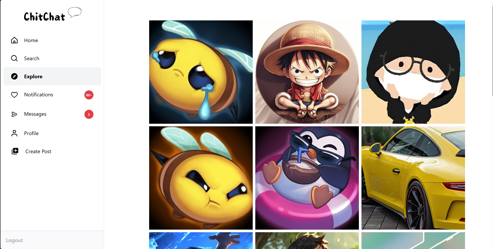
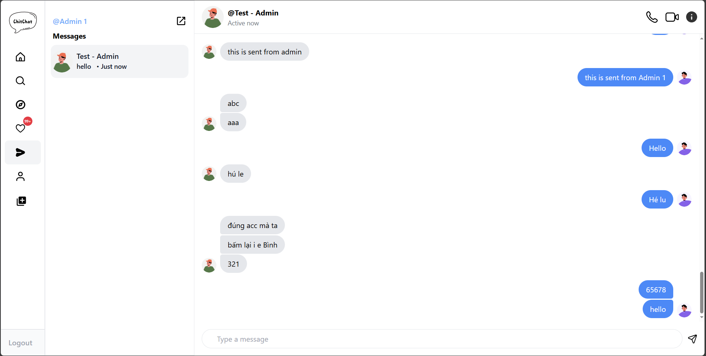
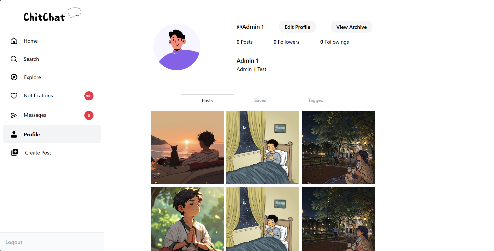
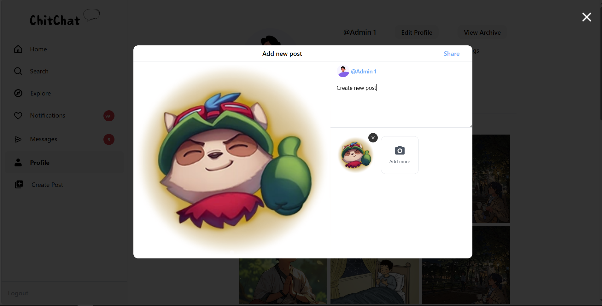

# Chit Chat - Frontend Website

This repository contains the frontend code for chit chat, a social networking platform, implementing user-friendly interfaces for features like user profiles, feeds, real-time chat, and recommendations. The app is built with **TypeScript** for type safety, powered by **Redux Toolkit (RTK)** for state management, and deployed on **Netlify** for quick and scalable hosting.

---

## ✨ Features

- **Feeds**: Personalized newsfeed based on user activity.
- **Notifications**: Real-time notifications for interactions.
- **Performance**: Lightning-fast build and runtime performance with Vite.
- **Real-Time Communication**: Audio/video calls and real-time chat powered by WebRTC.
- **Recommendation System**: Personalized suggestions for friends, groups, or content using collaborative filtering and user activity analysis.
- **Search**: Search for users, posts, or hashtags.
- **State Management**: Efficient and scalable state handling using Redux Toolkit (RTK).
- **Social Interactions**: Follow/unfollow, posting, and commenting.
- **User Management**: Registration, login, and profile updates.

---

## 🛠 Tech Stack

- **Framework**: ReactJS
- **Language**: TypeScript
- **Build Tool**: Vite
- **State Management**: Redux Toolkit (RTK)
- **Deployment**: Netlify
- **Styling**: CSS Modules / TailwindCSS
- **API Integration**: RTK Query

---

## 🚀 Installation Guide

### Prerequisites

- Install [Node.js](https://nodejs.org/)
- Install [Yarn](https://yarnpkg.com/) or use `npm`

### Steps

1. **Clone the repository**:

   ```bash
   https://github.com/LeMinhHoang1204/fe_talkVN_project.git
   cd chit-chat-frontend
   ```

2. **Install dependencies**:

   ```bash
   yarn
   ```

3. **Run the development server**:

   ```bash
   yarn dev or yarn dev:2 (For debug on 2 different port)
   ```

4. **Build for production**:

   ```bash
   yarn build
   ```

5. **Deploy to Netlify**:

- Push the repository to GitHub or GitLab.

- Connect your repository to Netlify.

- Netlify will automatically build and deploy your app.

---

## Demo

<div style="display: flex; justify-content: space-between; gap: 10px;">
  
  
</div>

<div style="display: flex; justify-content: space-between; gap: 10px; margin-top: 10px;">
  
  
</div>

---

## 🤝 Author
